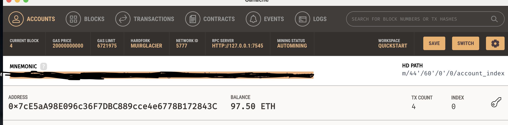
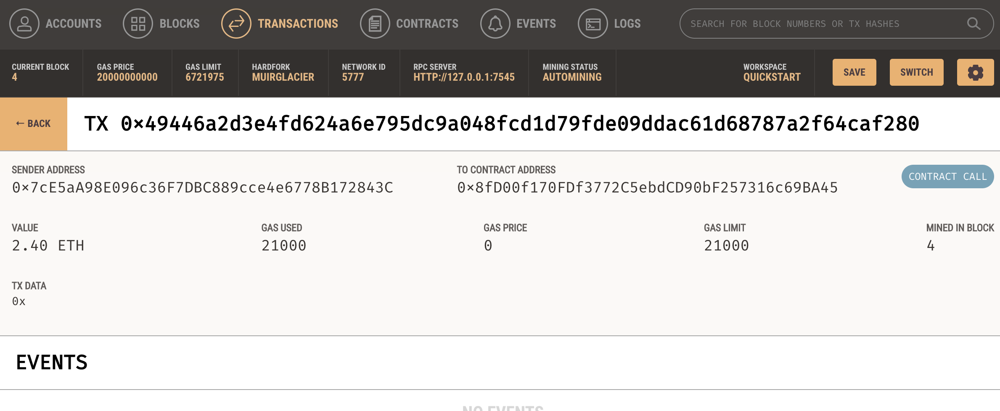

# Fintech-Finder


This is an Ethereum based digital wallet capable of sending and receiving digital assets to Fintech professionals for services rendered. 


## Technologies

This project uses Python 3.7 with the following packages and libraries:

- Streamlit

- web3

- typing

- dataclasses

- os

- requests

- dotenv

- bip44


## Installation Guide

The Fintech-Finder web app was built with Python 3.7. If the User wants to interact with the app, change settings, include new features, ect. Please install the following:  To get started using this application please go to [Python Download](https://www.python.org/downloads/) and select the version for your operating system. Then install the following libraries and packages.

``` sudo apt install python3-pip ```. This will install the pip that will make it easier to install the libraries.

``` pip install web3 ```

``` pip install streamlit ```

``` pip install typing ```

``` pip install dataclasses ```

``` pip install requests ```

``` pip install python-dotenv ```

``` pip install bip44 ```

``` pip install os-sys ```


## Usage

The file of interest is labeled ``` fintech_finder.py ``` . To run the web app first install the necessary packages. Then clone the repository to you local computer and navigate to the working folder via the terminal. The command to run the web app is ``` streamlit run fintech_finder.py ```. 


## Contributors

Stephen Thomas @ stephenthomas43@gmail.com

[Trilogy Education Services](https://www.trilogyed.com/)

[UC Berkeley Extension ](https://extension.berkeley.edu/)


## License 

MIT


# Preview of Web App
---

## Streamlit Web App with Sent Transaction verification


## Demo of Ganache Sender Account



## Demo of Ganache Sender Account Contract Call 


